# AIVA-Recruitment-Platform
AIVA Recruitment Platform is a modern SaaS solution streamlining hiring through job postings, candidate applications, interview scheduling, and AI-powered resume insights. With React frontend and Node.js/MySQL backend, it offers dashboards, analytics, and role-based access for recruiters and candidates, ensuring smarter, data-driven recruitment.


**Goal:** Build a modern **AI-powered Recruitment SaaS Platform** that streamlines the end-to-end hiring process — from job posting and candidate applications to interview scheduling, resume insights, and hiring pipelines.

---

## Overview

AIVA is a **full-stack recruitment system** with a **React.js frontend** and **Node.js/Express + MySQL backend**, designed for **Recruiters** and **Candidates**.

The platform features:

* Role-based access (Recruiter / Candidate)
* Job postings and applications
* Candidate pipeline management
* Interview scheduling system
* Resume insights with **AI-powered optimization** (Google Gemini API)
* Analytics dashboards for data-driven hiring decisions

---

## Input / Output

**Input:**

* Recruiter: Job details, candidate stages, interview slots
* Candidate: Resume (PDF), profile info, job applications

**Output:**

* Job listings, application tracking, and interview schedules
* AI-enhanced resume feedback with downloadable PDF reports
* Analytics dashboards for recruiters

---

## Pipeline

```mermaid
graph TD;
    A[Recruiter Posts Job] --> B[Candidates Apply + Upload Resume];
    B --> C[AI Resume Insights: Compare Resume vs Job Description];
    C --> D[Candidate Pipeline: Screening → Interview → Offer → Hired];
    D --> E[Interview Scheduling + Resume Management];
    E --> F[Analytics Dashboard: Jobs, Candidates, Stages, Stats];
```



---

## Detailed Workflow

### Recruiter Flow

1. Register/Login as recruiter
2. Post new jobs with title, description, salary, and location
3. Manage jobs and view applicants
4. Track candidates through pipeline stages (Sourced → Screening → Interview → Offer → Hired)
5. Schedule/manage interviews and avoid overlaps
6. Access analytics with bar/pie charts for hiring insights

### Candidate Flow

1. Register/Login as candidate
2. Dashboard: View applied jobs, upcoming interviews, and stats
3. Browse & apply to jobs
4. Upload/manage resumes with AI-based optimization
5. View interview schedules with recruiter details
6. Download AI resume review reports

---

## Resume Insights (AI-powered)

* Upload resume for a specific job
* AI analyzes resume vs job description (using **Google Generative AI**)
* Highlights missing skills, keyword gaps, and improvement suggestions
* Generates **downloadable PDF report** with actionable feedback

---

## Tools & Libraries Used

| Purpose         | Tool / Library                                                                |
| --------------- | ----------------------------------------------------------------------------- |
| Frontend        | React.js, Tailwind CSS, React Router, Axios, Lucide Icons, Chart.js, Recharts |
| Backend         | Node.js, Express.js, MySQL (mysql2), JWT, CORS, dotenv                        |
| Resume Analysis | Google Generative AI (Gemini), PDF.js, jsPDF                                  |
| File Uploads    | React Dropzone, Express static file serving                                   |
| UI Enhancements | SweetAlert2, Responsive Cards, Animate Pulse                                  |
| Dev Tools       | Postman, GitHub                                                               |

---

## Folder Structure

```bash
.
├── client/                # React frontend
│   ├── src/
│   └── public/
├── server/                # Node.js backend
│   ├── routes/
│   ├── models/
│   ├── controllers/
│   └── public/resume_recommendations/
├── database/              # MySQL schemas & migrations
├── assets/                # Screenshots, diagrams
├── docs/                  # Project documentation
├── README.md
└── package.json
```

---

## Sample Screens

* Recruiter Dashboard → Jobs, Candidates, Pipeline
* Candidate Dashboard → Job Applications, Interview Schedules
* Resume Insights → Upload, AI Suggestions, PDF Export

---

## Setup Instructions

### 1. Clone the repository

```bash
git clone https://github.com/yourusername/aiva-recruitment-platform.git
cd aiva-recruitment-platform
```

### 2. Install dependencies

Frontend:

```bash
cd client
npm install
```

Backend:

```bash
cd server
npm install
```

### 3. Configure environment

* Create `.env` in `server/` with DB credentials and JWT secret
* Setup MySQL schema from `/database/`

### 4. Run the app

Backend:

```bash
cd server
npm start
```

Frontend:

```bash
cd client
npm run dev
```

---

## Contact

📧 [irapadole2004@gmail.com](mailto:irapadole2004@gmail.com)
🔗 [LinkedIn](https://www.linkedin.com/in/ira-padole-3487062b4) • [Portfolio](https://irapadole.com)
